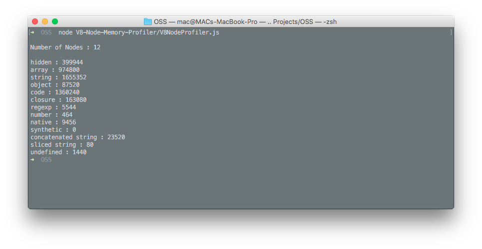

# V8 Memory Analyzer
Parsed output for the V8-Node memory bindings

Gives the parsed output of V8-Profiler npm package's [heap snapshot api](https://github.com/node-inspector/v8-profiler#heap-snapshot-api).

Install the Heap Snapshot API using npm :
```npm install v8-profiler```

And run it using node :
```node V8NodeProfiler.js```


